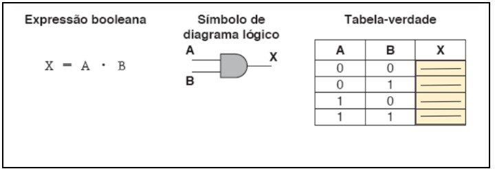
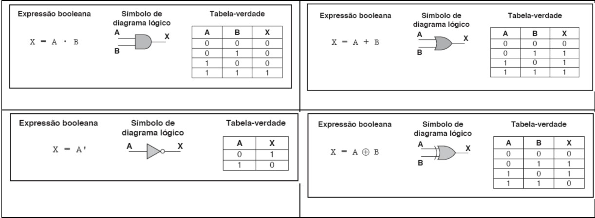
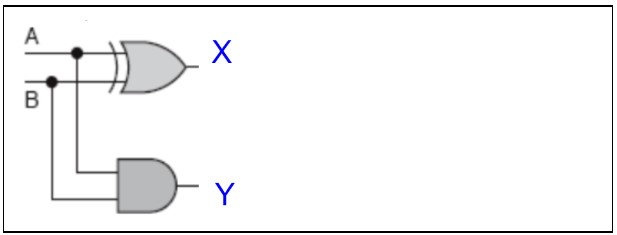
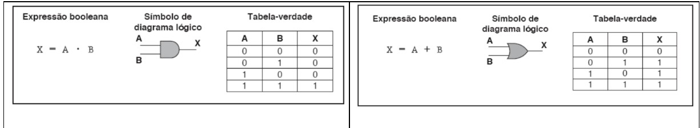
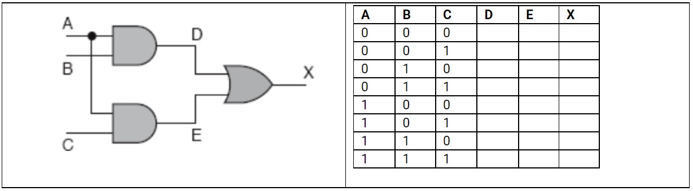
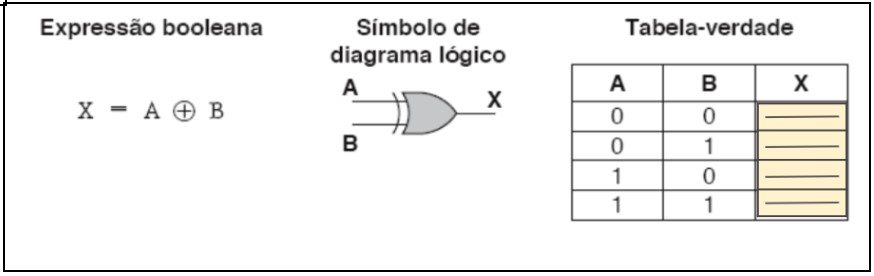
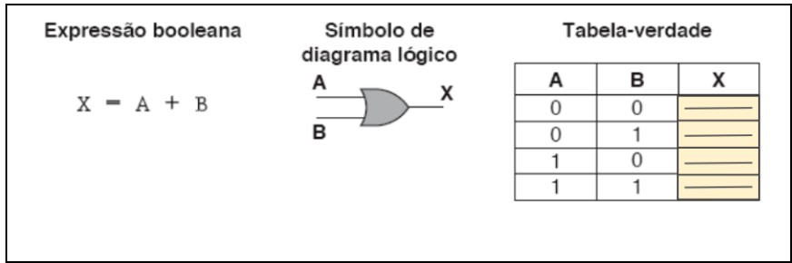
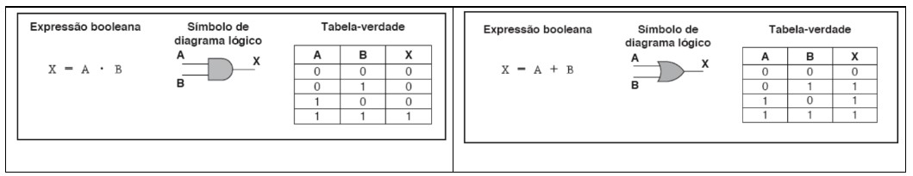
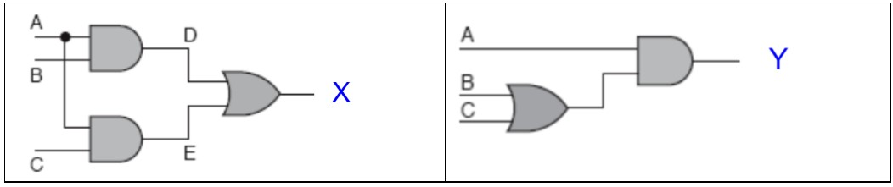

# AVALIAÇÃO 03 :shipit:

# Pergunta 01:
Inúmeras personalidades contribuíram para e evolução da computação com a utilizamos hoje em dia. As afirmações abaixo envolvem personalidades influentes na história da computação. 

I. John Napier, nascido em 1550, é reconhecido por ter criado o conceito de logaritmo como ferramenta para multiplicação e divisão de números grandes.  

II. Joost Bürgi, nascido em 1552, é reconhecido por ter criado o conceito de logaritmo como ferramenta para multiplicação e divisão de números grandes.  

III. George Boole, nascido em 1815, é reconhecido por ter criado a álgebra que utilizamos em nossos programas para expressões condicionais. 

IV. Alan Turing, nascido em 1912, é reconhecido por ter criado a álgebra que utilizamos na construção de circuitos digitais. 

V. Alan Turing, nascido em 1912, é reconhecido por construir máquinas teóricas que correspondem aos computadores atuais no que tange a limitação de memória 

VI. Alan Turing, nascido em 1912, propôs uma Máquina Universal que corresponde ao conceito de programa armazenado. 

Assinale a alternativa que apresenta indica as afirmativas verdadeiras.
    a) Apenas I, III, V e VI são verdadeiras. 

    b) Apenas I, II, III, VI são verdadeiras. 

    c) Apenas I, II, III, IV e V são verdadeiras. 

    d) Apenas III, IV, V e VI são verdadeiras. 

    e) Todas são verdadeiras. 

> [!IMPORTANT]
> b) Apenas I, II, III, VI são verdadeiras.

-------

# Pergunta 02:
Uma das expressões booleanas básicas é a expressão E, muitas vezes representada pelo ponto final (.) ou deixada implícita como fazemos normalmente em nossas expressões algébricas (e.g. ax + b = 0).  O circuito correspondente à expressão booleana E é essencial na construção de computadores digitais.  

A figura ilustra a expressão booleana e o diagrama lógico correspondente.

Escolha a alternativa que completa, correta e respectivamente, as lacunas da Tabela Verdade da figura. 
a) 0, 0, 1, 1. 

b) 1, 0, 0, 1. 

c) 0, 1, 1, 0. 

d) 1, 0, 0, 0. 

e) 0, 0, 0 1. 

> [!IMPORTANT]
> e) 0, 0, 0 1. 

-------

# Pergunta 03:
Duas das portas lógicas básicas na construção de computadores são as portas E e OU. A porta E é normalmente representada pelo ponto final (.) ou deixada implícita como fazemos normalmente em nossas expressões algébricas (e.g. ax + b = 0). A porta OU é normalmente representada pelo sinal de adição. Outras duas portas lógicas básicas na construção de computadores são as portas NÃO e OU-X. A porta NÃO é normalmente representada por um círculo na saída da porta (o). A porta OU-X é normalmente representada pelo sinal de adição embutido em um círculo. A porta OU-X produz o 0 quando as duas entradas são iguais, e o valor 1 quando são diferentes. A notação gráfica e as tabelas-verdade das portas E, OU, NÃO e OU-X estão ilustradas a seguir.

Analise o circuito a seguir e construa a sua tabela verdade para entender o que ele faz.

A partir da sua análise, avalie as seguintes asserções e identifique quais são as verdadeiras. 

I. O circuito calcula a soma de dois valores binários A e B 

II. O valor de X corresponde ao valor menos significativo da soma de dois valores binários A e B 

III. O valor de Y corresponde ao valor mais significativo da soma de dois valores binários A e B 

IV. O valor de Y será 1 caso A e B também sejam 1, o que corresponde ao vai-um da soma de A=1 e B=1  

V. Caso A e B sejam 1, o valor de X será 0, correspondendo à soma de 1 + 1 com vai-um que vai ser refletido no valor de Y 

VI. Caso A e B sejam 0, o valor de X será 0, correspondendo à soma de 0 + 0 

VII. Caso A e B tenham valores distintos, o valor de X será 1, correspondendo à soma de 1 + 0 

VIII. Caso A e B tenham valores distintos, o valor de Y será 0, dado que a soma de 1 + 0 não causa vai-um

    a) Apenas I, II e III são verdadeiras

    b) Apenas V, VI, VII e VIII são verdadeiras

    c) Todas são verdadeiras. 

    d) Apenas I, V, VI, VII e VIII são verdadeiras

    e) Apenas I é verdadeira

> [!IMPORTANT]
>c) Todas são verdadeiras.

-------

# Pergunta 04:
George Boole, nascido em 1815, é reconhecido por ter criado a álgebra que utilizamos em nossos programas para expressões condicionais e nos dispositivos computacionais para a implementação de circuitos lógicos. Seu livro “A Análise __________ da __________” (1847) constitui a base para o desenvolvimento de computadores digitais. Nele Boole apresentou os __________ formais de lógica sobre os quais o campo de lógica simbólica é construído. Boole recorreu aos símbolos e operações da __________ ao criar seu sistema de lógica. Ele associou o valor 1 ao conjunto __________, representando todas as coisas no universo, e o valor 0 ao conjunto __________. Ele restringiu seu sistema a essas quantidades e definiu operações que são análogas à subtração, adição e multiplicação. 

Escolha a alternativa que completa, correta e respectivamente, as lacunas 

    a) Matemática, Lógica, axiomas, álgebra, vazio, universal. 

    b) Matemática, Lógica, teoremas, álgebra, universal, vazio. 

    c) Matemática, Lógica, teoremas, geometria, universal, vazio. 

    d) Lógica, Matemática, axiomas, álgebra, universal, vazio. 
 
    e) Matemática, Lógica, axiomas, álgebra, universal, vazio.

> [!IMPORTANT]
>e) Matemática, Lógica, axiomas, álgebra, universal, vazio.

-------

# Pergunta 05:
Duas das portas lógicas básicas na construção de computadores são as portas E e OU. A porta E é normalmente representada pelo ponto final (.) ou deixada implícita como fazemos normalmente em nossas expressões algébricas (e.g. ax + b = 0). A porta OU é normalmente representada pelo sinal de adição. A notação gráfica e as tabelas-verdade das portas E e OU estão ilustradas a seguir.

Observe o circuito a seguir.

Ao aplicar os conceitos das portas lógicas E e OU no circuito acima, os valores que completam corretamente a tabela a última coluna da Tabela-verdade (coluna X) são: 

    a) 0, 0, 0, 0, 0, 1, 1, 1.

    b) 0, 0, 0, 1, 1, 1, 1, 1.

    c) 0, 0, 0, 0, 0, 1, 1, 0.

    d) 0, 0, 0, 0, 1, 1, 1, 1.

    e) 0, 0, 0, 0, 1, 1, 1, 0.

> [!IMPORTANT]
>a) 0, 0, 0, 0, 0, 1, 1, 1.

-------

# Pergunta 06:
Uma das expressões booleanas básicas é a expressão OU-Exclusivo, muitas vezes representada pelo símbolo de adição dentro de um círculo.  O circuito correspondente a essa expressão booleana é essencial na construção de computadores digitais, sendo utilizado, por exemplo, na construção de um circuito somador.  

A figura ilustra a expressão booleana e o diagrama lógico correspondente à expressão OU-Exclusivo.

Escolha a alternativa que completa, correta e respectivamente, as lacunas da Tabela Verdade da figura. 

    a) 1, 1, 1, 0. 

    b) 1, 0, 0, 0. 

    c) 1, 0, 0, 1. 

    d) 0, 1, 1, 1. 

    e) 0, 1, 1, 0. 

> [!IMPORTANT]
>e) 0, 1, 1, 0.

-------

# Pergunta 07:
Uma das expressões booleanas básicas é a expressão OU, muitas vezes representada pelo símbolo de adição (+).  O circuito correspondente à expressão booleana OU é essencial na construção de computadores digitais.  

A figura ilustra a expressão booleana e o diagrama lógico correspondente.

Escolha a alternativa que completa, correta e respectivamente, as lacunas da Tabela Verdade da figura.
    a) 1, 1, 1, 1. 

    b) 1, 0, 0, 1. 

    c) 1, 0, 0, 0. 

    d) 0, 1, 1, 0. 

    e) 0, 1, 1, 1.

> [!IMPORTANT]
>e) 0, 1, 1, 1.

-------

# Pergunta 08:
Duas das portas lógicas básicas na construção de computadores são as portas E e OU. A porta E é normalmente representada pelo ponto final (.) ou deixada implícita como fazemos normalmente em nossas expressões algébricas (e.g. ax + b = 0). A porta OU é normalmente representada pelo sinal de adição. A notação gráfica e as tabelas-verdade das portas E e OU estão ilustradas a seguir.

Analise os dois circuitos a seguir e identifique a expressão booleana que corresponde a cada um deles.

A partir da sua análise, avalie as seguintes asserções e identifique quais são as verdadeiras.
I. Um circuito é representado pela expressão booleana (AB + AC) 

II. Um circuito é representado pela expressão booleana A(B+C) 

III. Um circuito é representado pela expressão booleana (AC)(BC) 

IV. Um circuito é representado pela expressão booleana (AB)C 

V. Os circuitos são equivalentes por causa da propriedade distributiva 

VI. Os circuitos são equivalentes por causa da propriedade associativa

    a) Apenas I e II são verdadeiras. 

    b) Apenas III e IV são verdadeiras.

    c) Apenas III, IV e VI são verdadeiras.

    d) Apenas I, II e V são verdadeiras.

    e) Apenas I, II e VI são verdadeiras.

> [!IMPORTANT]
>d) Apenas I, II e V são verdadeiras.